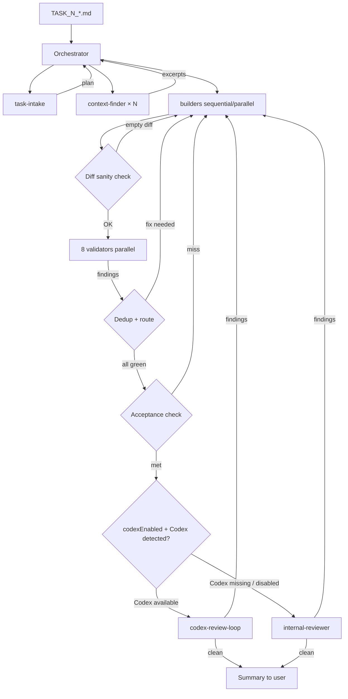

# Sub-Agents — Task Execution Toolkit

## Prerequisite

This pipeline assumes the project has already been bootstrapped per `requirements/launch.md`. The orchestrator's bootstrap-check step (Step 0) verifies the scaffold and refuses to proceed if it's incomplete. If you arrived here on an empty repo, run `launch.md` first.

Sub-agents must be installed into `.claude/agents/` before they can be invoked. See `requirements/README.md` section "Sub-agents — install before first use" for installation commands.

Sub-agents read `requirements/00-overview/03-project-config.md` before each task. Make sure that file exists and reflects current project state.

Specialized Claude Code sub-agents that implement and verify changes against the architecture defined in `requirements/`. The set is split into three roles:

| Role | Purpose | Folder |
|---|---|---|
| **Builders** | Implement a specific kind of change (screen, dialog, data feature, mapper, endpoint, migration, resource, cross-feature nav). | `builders/` |
| **Validators** | Self-check the result against the architecture (dependency rules, MVI pattern, anti-patterns, naming, DI wiring, Compose stability, data-layer boundaries, build green). They are **gates**: the orchestrator does not declare a task done until every relevant validator passes. | `validators/` |
| **Helpers** | Task intake, orchestration, codebase lookup, external review loop (Codex or internal). | `helpers/` |

## Execution flow

```
requirements/tasks/TASK_N_TITLE.md
        ↓
[helpers/task-intake] — parses the task, picks builders + validators
        ↓
[helpers/orchestrator] — runs the loop:
        ├── builders/* (one or more, in dependency order)
        ├── validators/* (every applicable one — all MUST pass)
        └── external review — exactly one reviewer per task, resolved per codexEnabled:
              ├── [helpers/codex-review-loop] (Codex plugin installed)
              └── [helpers/internal-reviewer]  (Claude-backed local fallback)
        ↓
Task done when every validator passes AND the external reviewer returns clean.
```



Helpers and validators run **on every task** (validators are always-on invalidators of premature "done"). Builders run only when their kind of change is requested. The **external-review gate also runs on every task**; only the reviewer identity (Codex vs. internal-reviewer) varies — see *External review* below.

## How tasks are written

Place task specs at `requirements/tasks/TASK_<N>_<TITLE>.md`. A task file states **what** to build, not **how** — the agents read `requirements/` for the architecture. Minimum task shape:

```markdown
# TASK 1 — Add "Note archive" screen

## Goal
Add a sub-screen to `:ui-screen-features:profile` showing an archive of the user's
notes for a configurable date range.

## Inputs
- Source data: `NoteFeature.observeNotes(start, end)` (assume it exists).
- Entry point: a card on `ProfileOverviewScreen` already triggers `onNoteArchiveClick`.

## Acceptance
- New route under `ProfileRouter.NoteArchive(initialRange: DateRange)`.
- Seven MVI files following `requirements/14-cookbook/01-add-screen.md`.
- iOS XCFramework + Android debug both build green.
```

The task file is the **only** thing the user has to write. The agents pull architecture from `requirements/` and the live code.

## Triggering an execution

1. Drop the task file in `requirements/tasks/`.
2. Tell the parent Claude session: *"Run task `TASK_1_note_archive.md`."*
3. Parent invokes `helpers/orchestrator`.
4. Orchestrator drives the rest.

The user does not invoke individual builders or validators by hand. They can, though, for one-off touch-ups (e.g. *"run validators/anti-pattern-scanner on the current branch"*).

## External review (Codex or internal-reviewer)

The orchestrator always runs an external-review pass after every internal validator is green. **Which reviewer runs is governed by `codexEnabled` in `requirements/00-overview/03-project-config.md`** plus runtime detection of the Codex plugin:

| codexEnabled | Codex plugin installed | Reviewer |
|---|---|---|
| auto *(default)* | yes | `codex-review-loop` |
| auto *(default)* | no  | `internal-reviewer` |
| true | yes | `codex-review-loop` |
| true | **no** | **escalation** — orchestrator refuses to silently downgrade |
| false | *(skip detection)* | `internal-reviewer` |

Both reviewers emit the **same output shape**, so the rest of the loop (route findings to builders → re-run validators → re-review) is reviewer-agnostic.

### Codex plugin (preferred when available)

[openai/codex-plugin-cc](https://github.com/openai/codex-plugin-cc) is the official OpenAI plugin for Claude Code. Cross-provider review (a different model checks the writer model's work) significantly reduces sycophancy bias. Install per the plugin's README — typically requires Node.js 18.18+, the Codex CLI, and a ChatGPT subscription or OpenAI API key.

After install, `codexEnabled: auto` picks it up automatically. To force Codex (fail-loud when the plugin is missing), set `codexEnabled: true`.

### Internal reviewer (default fallback)

`helpers/internal-reviewer` runs a Claude-backed senior-reviewer pass: reads the diff, cross-references `requirements/13-anti-patterns/`, classifies findings, and routes them to the right builder using the same routing table as `codex-review-loop`. No third-party install needed.

Caveat: it's the same model family as the rest of the pipeline, so it does **not** provide cross-provider independence. It catches obvious bugs and scope leaks but is weaker at challenging design decisions the writer model already endorsed. Prefer Codex when available; use internal-reviewer as the safe default when it isn't.

## Installing the agent definitions

These markdown files are written in the standard Claude Code sub-agent format (YAML frontmatter + body). To make them discoverable as `subagent_type` values, follow the install instructions in `requirements/README.md` section "Sub-agents — install before first use". The symlink form is recommended for active projects — edits under `requirements/sub-agents/` propagate immediately.

## Agent inventory

### Builders (one per cookbook recipe)

| Agent | What it builds | Recipe |
|---|---|---|
| `data-service-scaffold-builder` | Initial `:data-services:backend` (empty `<Product>Api`, `BackendClient`, `TokenProvider`, `ClientLogger`, `BackendModule`, auth-bootstrap stubs) and `:data-services:database` (empty `Database` at `version = 1`, `DatabaseBuilder` expect/actual, `DatabaseModule`, token DAOs/entities). One-shot, runs before any `endpoint-builder` / `room-migration-builder` on a freshly-bootstrapped project. | `02-module-structure/09-data-service-modules.md`, `06-data-layer/01-backend-client.md`, `06-data-layer/02-token-provider.md`, `06-data-layer/04-database.md` |
| `feature-module-scaffold-builder` | A brand-new empty `:ui-screen-features:<name>` module (root MVI files + empty `<Feature>Router` + `RootRouter`/`RootComponent` wiring). Runs before `screen-builder` for the first screen of a new top-level feature. | `02-module-structure/07-ui-feature-modules.md` |
| `screen-builder` | A sub-screen inside an existing `:ui-screen-features:*` feature. | `14-cookbook/01-add-screen.md` |
| `dialog-builder` | A `:ui-dialog-features:*` bottom sheet feature. | `14-cookbook/02-add-dialog.md` |
| `data-feature-builder` | A `:data-features:*` module + feature-api contract. | `14-cookbook/03-add-data-feature.md` |
| `mapper-builder` | A new mapper file inside an existing `:data-mappers:*` direction. | `14-cookbook/04-add-mapper.md` |
| `endpoint-builder` | A new method on `<Product>Api` + DTOs. | `14-cookbook/06-add-endpoint.md` |
| `room-migration-builder` | A new `Migration<N>To<N+1>` + schema bump. | `14-cookbook/05-add-room-migration.md` |
| `resource-builder` | Strings (all locales), drawables, icons, fonts. | `14-cookbook/07-add-resource.md` |
| `cross-feature-nav-builder` | Wires navigation from one feature into another. | `14-cookbook/08-add-cross-feature-nav.md` |

### Validators (always-on invalidators)

| Agent | What it checks | Authoritative chapter |
|---|---|---|
| `architecture-validator` | Module dependency rules (UI → feature-api only, no data-services from UI, etc.). | `02-module-structure/02-dependency-rules.md` |
| `mvi-contract-validator` | Seven-file MVI per screen/dialog; `State` defaults, `Contract.Empty`, `BaseViewModel` ctor pattern. | `03-architecture-patterns/01-mvi-contract.md`, `04-base-classes/*` |
| `anti-pattern-scanner` | Forbidden patterns (viewModelScope, `runBlocking`, `LaunchedEffect(Unit)` for nav, `Color(0xFF...)` inline, `stringResource(R.string...)`, ...). | `13-anti-patterns/01-forbidden-patterns.md` |
| `naming-convention-validator` | File/class/function/package naming, sealed-type shape, `stub*()` previews. | `09-conventions/02-naming.md`, `09-conventions/03-packages.md` |
| `di-validator` | `@Single(binds = [...])`, `@Module @ComponentScan`, module registered in `:shared/Koin.kt`. | `08-dependency-injection/*` |
| `compose-stability-validator` | `@Immutable` on state, `ImmutableList`/`ImmutableSet`, no `mutableStateOf` for logical state, no inline `dp`/`sp`/colors outside design-system. | `09-conventions/04-compose-rules.md`, `13-anti-patterns/01-forbidden-patterns.md` |
| `data-layer-validator` | DTO all-nullable + default `= null`, Repository returns domain (never DTO), mappers via `:data-mappers:*`, range reconciliation, `AppLogger.Mapping.log` in DTO→Entity. | `06-data-layer/*`, `07-mappers/*` |
| `build-validator` | iOS XCFramework assemble (task name derived from `iosFrameworkName`, gated by `iosEnabled`) and `./gradlew :androidApp:assembleDebug` both green. | n/a — runs Gradle directly. |

### Helpers

| Agent | What it does |
|---|---|
| `task-intake` | Reads `requirements/tasks/TASK_*.md`, classifies the change (screen / dialog / data-feature / …), enumerates the builders and validators that apply, and returns a structured execution plan to the orchestrator. |
| `orchestrator` | Drives the full execution loop: builders → validators → external review (Codex or internal) → fixes → repeat. The single agent the parent session invokes per task. |
| `context-finder` | Locates the existing modules/files relevant to a task (e.g. find `ProfileComponent.kt`, `ProfileRouter.kt`, the existing `ProfileOverviewState.kt` shape) so a builder doesn't have to re-grep. |
| `requirements-lookup` | Given a short keyword from a task or a builder's question, returns the exact `requirements/*.md` chapter and line range to read. |
| `codex-review-loop` | Wraps the Codex plugin's review output, classifies findings (architecture / style / bug / scope), and routes each to the right builder for the next iteration. Requires the Codex plugin; refuses to run when `codexEnabled: false` or the plugin is missing. |
| `internal-reviewer` | Local fallback for `codex-review-loop` — runs a Claude-backed senior-reviewer pass over the current diff when the Codex plugin is unavailable (or `codexEnabled: false`). Emits the same output shape so orchestrator wiring is reviewer-agnostic. |

## Tool budgets

Each agent declares a minimal tool set in its frontmatter:

- **Builders**: `Read, Edit, Write, Bash, Grep, Glob` — they need to read existing code, write new files, and run targeted gradle assembles.
- **Validators**: `Read, Bash, Grep, Glob` (no `Edit`/`Write`) — they report findings, they don't auto-fix. Auto-fixing belongs to the builder responsible for the violated rule.
- **Helpers**: vary. `orchestrator` gets `Agent` (to spawn the others); `task-intake` and `context-finder` get read-only tools; `codex-review-loop` and `internal-reviewer` get `Read, Bash, Grep, Glob, Agent`.

## What sub-agents do NOT do

- **No new module without an explicit task.** `data-feature-builder` adds a `:data-features:<x>` module because the task asked; it does not add unrelated modules in passing. See `13-anti-patterns/02-when-to-stop-and-ask.md`.
- **No refactors.** A builder fixes exactly what the task requested. Drift in adjacent code is logged, not patched.
- **No version bumps.** `gradle/libs.versions.toml` is off-limits unless a task explicitly targets it.
- **No backend changes.** Mobile-side only. Endpoint shape comes from the backend contract — the `endpoint-builder` verifies the DTO shape but does not invent endpoints.
- **No tests.** This project explicitly opts out of tests by default. Tests are a separate task on explicit request.

## Worked example end-to-end

Suppose you drop the following file:

`requirements/tasks/TASK_1_note_archive_screen.md`:

````markdown
# TASK 1 — Add "Note archive" screen

## Goal
Add a sub-screen to `:ui-screen-features:profile` showing an archive of the user's
notes for a configurable date range.

## Inputs
- Source: `NoteFeature.observeHistory(start, end)` (assume exists).
- Entry point: a card on `ProfileOverviewScreen` already triggers `onNoteArchiveClick`.

## Acceptance
- New route `ProfileRouter.NoteArchive(initialRange: DateRange)`.
- Seven MVI files following the cookbook recipe.
- Build green on Android + iOS XCFramework.

## Out of scope
- Filtering, search, pagination — separate task.
````

You ask the parent Claude session: *"Run task TASK_1_note_archive_screen.md."*

What happens (abbreviated):

1. **orchestrator** spawns **task-intake**. Plan returns:
   - Builders: `screen-builder`.
   - Validators: all 8.
   - No blockers.
2. **orchestrator** spawns **context-finder** with: "where is `ProfileComponent`? where is `ProfileRouter`? does `NoteFeature` exist?". Returns 4 file paths + signatures.
3. **orchestrator** spawns **screen-builder** with task content + context excerpts. Builder writes 7 files in `ui-screen-features/profile/.../notearchive/`, edits `ProfileRouter.kt`, edits `ProfileComponent.kt`. Reports done.
4. **orchestrator** runs Diff sanity check — 9 files changed, all under `ui-screen-features/profile/`. OK.
5. **orchestrator** spawns 8 validators in parallel. `mvi-contract-validator` flags 1 finding: `ProfileNoteArchiveContract.Empty` is missing the `onRangeChange` no-op. `naming-convention-validator` flags the same finding (dup).
6. **orchestrator** dedupes → routes 1 finding to `screen-builder`. Builder fixes. Validators re-run, all green. `build-validator`: 2/2 PASS.
7. **orchestrator** runs Acceptance check — grep `ProfileRouter.NoteArchive` in changed files: hit. Acceptance bullet 1 met.
8. **orchestrator** resolves the external reviewer per `codexEnabled` + Codex detection, invokes **codex-review-loop** or **internal-reviewer**. Returns clean.
9. **orchestrator** posts the summary, the user reviews, commits.

End-to-end: roughly 4-6 minutes of agent time, ~$0.5-1.5 in API cost.

## When NOT to use this pipeline

The orchestrator + 8-validator + Codex flow is overhead. Skip it for:

- **One-line bug fixes** — e.g. `s/foo/bar/` in a string. Edit and verify with `./gradlew :androidApp:assembleDebug` directly.
- **Hotfixes on a release branch** — bypass the pipeline, fix surgically, the post-mortem retroactively writes the TASK file if useful.
- **Experimental spike branches** — exploring whether a pattern works at all. Pipeline assumes architectural conformance; spikes are pre-conformance.
- **Read-only tasks** — code review, design proposal, "what would it look like if…" questions. Use `Plan` agent or just chat.

For these, skip `orchestrator`. Either work in a regular chat or invoke a single agent directly:

```
Agent(subagent_type: "anti-pattern-scanner", prompt: "Scan the current diff and report findings.")
```

Use the full pipeline when the task touches the architecture (new feature, new data, schema change, cross-feature wiring).

## Mechanical lint

`requirements/sub-agents/lint.sh` catches mechanical drift in this folder: dead chapter-link refs, missing frontmatter fields, README inventory mismatches, orphan inventory entries, missing top-level docs. Run it after editing any sub-agent file:

```bash
bash requirements/sub-agents/lint.sh
```

Anything beyond mechanical drift (semantic correctness, agent prompt quality, cross-agent consistency) is the user's call — review the diff like any code change.
